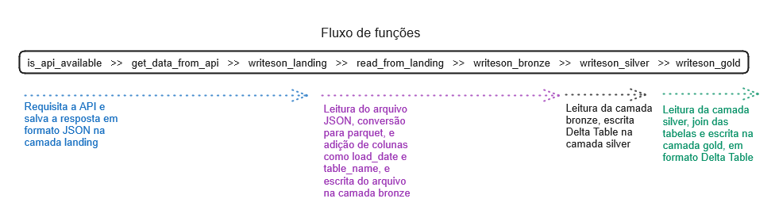
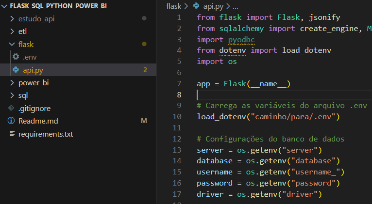
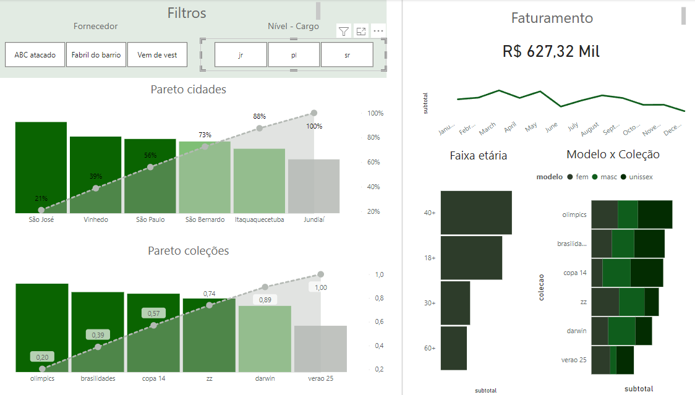

# Engenharia / Análise de dados
Neste repositório continuamos os estudos de análise de dados, utilizando a mesma estrutura de dados utilizada em  e , com uma diferença, neste repositório existe uma pasta chamada data_generator, e nela contém o script para inserção de dados no SQLSERVER.

E também faremos mais algumas mudanças, com a finalidade de avançar na utilização de técnicas.

Aqui neste estudo introduzimos o conceito de **medalion arquitecture**, utilizando os seguintes pacotes: <br>
deltalake e pyarrow

Um panorama da arquitetura: <br>


## O caso

Este repositório é parte de uma série de repositórios em que apresento soluções para o cenário de Dados(Análise e Engenharia). No reporitório  foi apresentado um cenário em que a análise é feita toda em SQL. Já neste, é apresentada uma solução um pouco mais complexa, usando Pandas, conceito de Datalake, DW, coleta de dados por API e Power BI.

No link a seguir está a explicação do estudo e estrutura de tabelas
. 

## Ambiente
O primeiro passo para iniciar o ambiente é criar um ambiente virtual. Você pode utilizar o método que estiver mais familiarizado para isso.

Caso não esteja familiarizado com nenhum, você pode executar:

```python
python -m venv estudo_api
```

Esse comando irá criar um ambiente virtual para que as bibliotecas sejam instaladas.

Após ativar o ambiente virtual, execute.

```python
pip install -r requirements.txt
```

Este comando instalará os pacotes e suas versões contidos no arquivo requirements.txt.

```python
Flask==2.0.3
SQLAlchemy==1.4.25
pyodbc==4.0.32
Werkzeug==2.0.3
PyMySQL==1.0.2
requests
pandas==2.2.2
python-dotenv==1.0.1 
deltalake==0.19.0
pyarrow==17.0.0 
```

Feito isso, será possível notar uma pasta nova no diretório, com o nome escolhido para o ambiente virtual.

## SQLSERVER
Execute o arquivo sql\criar_tabelas.sql. Isso criará as tabelas de exemplo, que servirão a API.

## Gerador de dados
Execute o arquivo data_generator\generator.py assim que criar as tabelas no SQL, este arquivo irá popular as tabelas com os dados de exemplo.
***Observação importante é que os dados são gerados de forma aleatória, então cada vez que executar terá soma de valores, nomes e ids diferentes***

## Flask
Crie um arquivo chamado .env na mesma pasta da aplicação FLask, com os seguintes dados:

```python
server = 'seu server'
database = 'nome do banco'
username = 'user '
password = 'senha'
driver = 'driver para sqlserver aqui usei esse ODBC Driver 17 for SQL Server'
```
Execute o arquivo flask\api.py. Ele tornará disponível a API para os dados contidos no banco de dados. <br>

***Atenção para o preenchimento do arquivo .env, pois ele é que montará a string de conexão.*** <br>


## ETL Python
A aplicação que coleta os dados, transforma e carrega na pasta para consumo, utiliza diversas bibliotecas Python, como Pandas, Pyarrow, Delta Lake, Json e Requests.

Basta executar o arquivo etl\functions.py, e as funções serão executadas na ordem correta para que se tenha os arquivos prontos em suas devidas camadas.

### funções
docstrings: <br>
**is_api_available(table_name:str)** <br>
"""
Args:
    table_name (str): Nome da tabela a qual se consulta via API

Raises:
    Exception: Indisponibilidade do serviço

Returns:
    str: lista com mensagem 'Disponíve', response e url
""" <br>
**get_data_from_api(table_name)** <br>
"""
Args:
    table_name (_type_): Nome da tabela a qual se consulta via API

Returns:
    tuple: response.content,table_name
""" <br>
**writeson_landing(table_name:str,layer=1,extension="json")** <br>
"""
Args:
    table_name (str): Nome da tabela a qual se consulta via API
    layer (int, optional): Camada na qual será escrito o arquivo. Defaults to 1.
    extension (str, optional): Extensão do arquivo. Defaults to "json".
Calls: 
    get_data_from_api(): Requisita API através do nome da tabela
    path_definition(): Define o diretório conforme table_name,layer e extension
    path_builder(): Cria o diretório, caso não exista

Writes:
    object: Escreve o objeto no diretorio definido
""" <br>
**read_from_landing(table_name:str,layer=1,extension="json")** <br>
"""
Args:
    table_name (str): Nome da tabela a qual se consulta via API
    layer (int, optional): Camada na qual será escrito o arquivo. Defaults to 1.
    extension (str, optional): Extensão do arquivo. Defaults to "json".

Returns:
    object: Pandas DataFrame
""" <br>
**add_columns(df:pd.DataFrame,table_name:str)** <br>
"""
Args:
    df (pd.DataFrame): Pandas Dataframe a ser tratado
    table_name (str): Nome da tabela fonte do Dataframe

Returns:
    pd.DataFrame: Pandas Dataframe com a nova coluna 'load_date'
""" <br>
**writeson_bronze(table_name:str,layer=2,extension="csv")** <br>
"""

""" <br>
**writeson_silver(table_name:list,layer=3,extension="csv")** <br>
"""

""" <br>

**writeson_gold(table_name:list,layer=3,extension="csv")** <br>
"""

""" <br>

**path_definition(src_layer=1,dstn_layer=2,table_name="table_name",context="dev",src_extension="csv",dstn_extension="csv")** <br>
"""
Args:
    layer (int): A camada onde será salvo/coletado o arquivo
    context (str): contexto pode ser dev, prod ou teste
    table_name (str): Nome da tabela
    extension (str): Extensão do arquivo

Returns:
    str: caminho a salvar/coletar um arquivo
""" <br>
path_builder(dir_path: str)
"""
Args:
    dir_path (str): path completo de uma tabela
    
Runs:
    Cria diretório, caso não exista

Returns:
    str: path sem o nome do arquivo
""" <br>

## Servir os dados da Delta Table OBT via API

O arquivo etl\serving.py cria uma API para serviço dos dados integrados na tabela OBT. Assim a conexão do Power BI pode ser feita por este meio, sem a necessidade de inserir os dados da OBT no SQLSERVER.

## Power BI

No link a seguir  estão descritas as funções e fórmulas M e DAX utilizadas para criar o Dashboard. A intenção nesse arquivo é apenas nortear a construção das medidas.




***links úteis:***

***Escrever dados de Pandas Dataframe no SQL SERVER.***

https://learn.microsoft.com/en-us/sql/machine-learning/data-exploration/python-dataframe-sql-server?view=sql-server-ver16#load-a-dataframe-from-the-csv-file